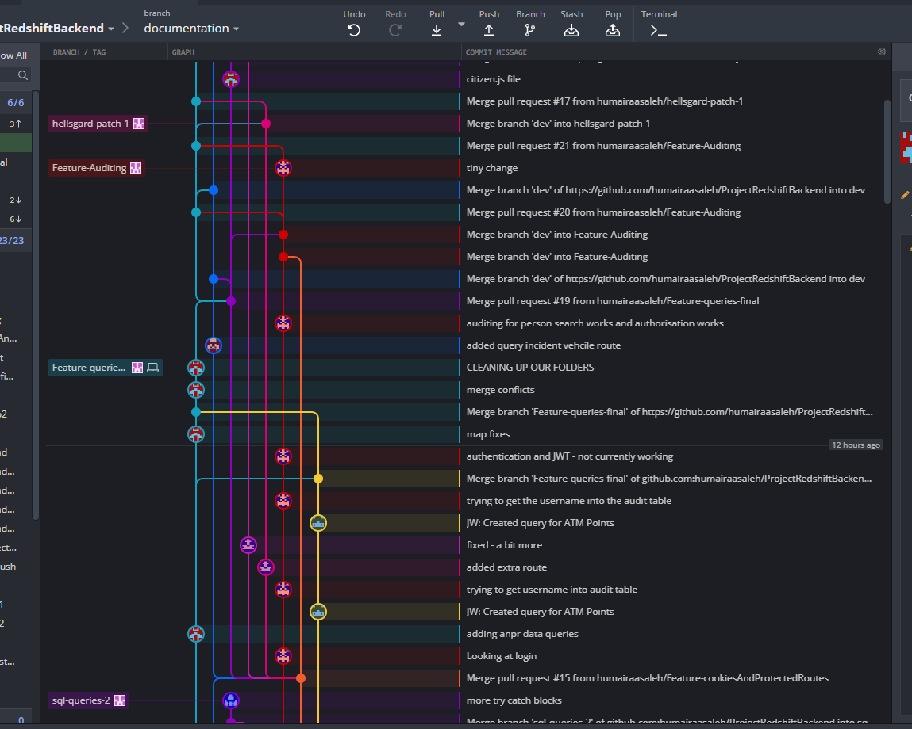

# Redshift Group project
## Team 1
___

## Brief

Our customer works at the National Investigation Unit and has been building a relationship with a third party provider to get access to some data.
The provider is referred to as Redshift. Redshift specialises in gathering call records, financial transactions and automatic number plate recognition (ANPR) sightings. 
The data comes in the form of many large .csv files. This data needs to be protected with restricted access, and this access needs to be audited. 

### Scenario 1 - A suspect has been detained
An investigator has detained a suspect. They need to know the background information about this person. 
This should include:
- Biographical information
- Associates
- Financial transactions
- Whereabouts

### Scenario 2 - An incident has occurred
The team are investigating an incident that has occurred at a particular location. They need to work out who was in the area at the particular point in time. 

### Scenario 3 - Suspect flees the scene
An officer has spotted a suspect fleeing the scene of an incident in a car. They have reported back with the car's number plate. 
The investigators now need to search on car registration to work out.
- Who the suspect was?
- Where else have they been?

### MVP
After speaking with out product owner (PO) he told us the MVP was scenario 1 and 2, but it would be great to see scenario 3 as well. 
The page needs to look professional as well as be streamlined and simple to use. 
A stretch goal was user login and authentication using a username and password, ideally this would be stored as cookies so that it logs a user off after a defined time. For Scenario 2, an option to add a radius for the location would also be good. 

___
## Planning and design phase

In the initial stages of planning we created a risk assessment to ensure we were prepared for any issues that could arise during the project. Figure one below shows this and the severity scores associated with each potential problem.

*figure 1: Risk assessment including a severity score based on the liklihood and impact*

For planning the project we used a Jira board and organised the work into 2 one week sprints. We all worked on this together to determine the user stories as well as setting MoScoWs priority for each and the story point estimates. 

*figure 2: Jira board showing the backlog of sprint 2*

### Version Control
For version control we used github, we had 2 repositories for backend and frontend respectively and used branch protection rules for the main and dev branches. We worked using a feature branch model as can be seen from figure 3 and 4, which show the network graphs for the repos

*figure 3: Snapshot of the back end repository network graph*

*figure 4: Snapshot of the front end repository network graph*

### Backend
As a group we discussed the different options for technology to use for the back end, and it was decided that using the MERN stack was a better option than using a Spring boot Java framework for the backend and React for the front end. 

### Frontend
We determined the best way to implement the front end was by using React. But before we started coding anything we worked together and with our Product Owner (PO) to produce a wireframe so that we could refer back to it in development. One brief from the PO was to have the website look sleek and professional, so we tried to ensure this with the wireframe. Figures 5-7 show the wireframes used in development. 

*figure 5: Wireframe plan for the login page*

*figure 6: Wireframe plan for the home page*

*figure 7: Wireframe plan for the scenario1 page*

___
## Database and network 
___
### AWS
This project used a cloud based database, we used a micro RDS database server on AWS (Amazon web services) with XXX GB storage. 
The RDS is in a public subnet within a VPC that is accessed via the internet gateway. To improve security only our personal IP addresses have access to the database. This would need to be changed if the service was being rolled out to a wider audience. 

*figure 9: Diagram showing the cloud architecture used*

___
## Code 
___
This project is implemented using an adapted MERN stack, using mySQL instead of MongoDB as the data was relational. 

### Backend
The backend for this project was written with Express. Initially the required npm packages were installed and then an Express app made. 

    npm install  <packages >

The backend consisted of routes for each page required as well as a server.js file where the bulk of the logic took place. This was also where the passport logging in and authentication logic was located. 

The routes files are a combined service and controller file and contain routing information and the SQL queries. The SQL queries were run using the sequelize package.  

Security and auditing was done in the backend using express-passport. Figure 10 shows how this works.

*figure 10: Diagram showing the architecture of the security process*

Auditing occurred when a user sent a query person request and this was logged in a table in the database with the timestamp, the user that made the request and the SQL query that was made.

*figure 11: Snapshot of the users and audit tables in mySQL workbench*

### Frontend
The Frontend for this project was written using the JavaScript framework React. This allowed us to build a single page application, which improves browser rendering speeds. 

Once we had the basic logic sorted we worked towards making our website design fit the wireframe we had planned initially. There was a fair amount of website evolution as can be seen from figures 12-20. The react-bootstrap CSS library was used to style the website, and using this meant that we could make the website look both professional and user friendly. 

*figure 12: Final login page*

*figure 13: initial output of the cards with no styling*

*figure 14: cards with styling*

*figure 15: Image showing the loading page*

*figure 16: The initial page where our Scenario1 data was output to*

*figure 17: Tabs were added to separate the data*

*figure 18: A loading message was added to appear on the map whilst data was being fetched.*

*figure 19: Markers were added to the map to show a suspects recent whereabouts*

*figure 20: Styling was added to the scenario 1 webpage*

## Axios
For our HTTP requests we used axios, a promise-based HTTP client. Axios has a simple syntax to and works well for what we are looking for. Each axios request was protected by a JWT authentication process and access to the database was restricted if this was not present in the header of the request.  

*figure 21: The code used for sending the JWT token in the request header*

## Authentication
Authentication was done using express-passport and bcrypt for hashing and comparing hashed passwords. When a user logged checks are made if the user is in the database, then the password was authenticated using bcrypt. This then creates a JWT token which is saved to local.storage and can be sent in the HTTP request headers. 

___
## Testing
___

### Backend testing
For testing the backend we used mocha chai and istanbul for coverage. Figure 22 shows the coverage for testing showing 73% coverage across all files. 

*figure 22: Coverage for backend testing*

### Frontend testing
For testing the frontend we had initially planned to learn selenium in order to do this but time constraints meant we couldn't do this. 

___
## Stretch Goals
___
A stretch goal of completing scenario 3 was thought about in the planning stage but we didn't have enough time to complete this. 
___
## Acknowledgements
___
Without the help of Jordan Harrison and Reece Elder from QA this project would not have gotten off the ground along with all the work from our fantastic team members.

* Katie Diggory
* Helen Gardener
* Christopher Jones
* Daniel Robinson
* Humairaa Saleh
* Joshua Willmott

